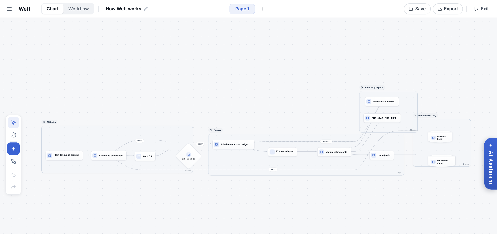

<div align="center">

# Weft

**An AI diagramming canvas where the diagram stays data — describe a system in
plain language, edit the result by hand, round-trip it back to Mermaid.**

[**Live demo**](https://fanmengwen.com) · [Architecture](ARCHITECTURE.md) · [License](LICENSE)

<br/>



<sub>Weft describing itself. The Mermaid source below was pasted onto the canvas,
validated, and laid out by ELK — every node in the screenshot is still individually
editable.</sub>

</div>

## Why

AI diagram generators mostly hand you a picture, or a block of Mermaid that renders
into one. The moment you want to move a box or reroute one edge, you are back to
prompt roulette. Weft takes the opposite position: generation, editing, and export
all operate on a single graph model. The model streams structured output onto the
canvas, your hands refine it, and the result serializes back to the same text
formats it came from — so a diagram can keep living in git, not in a screenshot.

Nothing about that loop needs a server, so there isn't one. Documents persist in
IndexedDB, and model keys stay in your browser: requests go directly from the page
to the provider you configured, and nowhere else.

## Try it

Open the [demo](https://fanmengwen.com), create a flowchart, and paste this onto
the canvas. It is the exact source of the screenshot above:

```
flowchart LR
  subgraph studio[AI Studio]
    prompt[Plain-language prompt] --> stream[Streaming generation]
    stream --> dsl[Weft DSL]
    dsl --> gate{Schema valid?}
    gate -->|repair| stream
  end
  gate -->|apply| nodes
  subgraph canvas[Canvas]
    nodes[Editable nodes and edges] --> elk[ELK auto-layout]
    elk --> hand[Manual refinements]
    hand --> hist[Undo / redo]
  end
  subgraph ship[Round-trip exports]
    text[Mermaid · PlantUML]
    media[PNG · SVG · PDF · MP4]
  end
  hand --> text
  hand --> media
  text -.->|re-import| nodes
  subgraph local[Your browser only]
    keys[(Provider keys)]
    idb[(IndexedDB store)]
  end
  stream -.->|BYOK| keys
  hist --> idb
```

To generate diagrams from prompts instead of pasting them, add a model key in
Settings. Ten providers are supported — from hosted APIs to any OpenAI-compatible
endpoint to local Ollama — and keys never leave the browser. The UI ships in seven
languages and defaults to Chinese.

## Run it locally

```bash
git clone https://github.com/fanmengwen/weft.git
cd weft && npm install
npm run dev   # http://localhost:3000, Node >= 18
```

Container images are published to GHCR on every push to `main`; `Dockerfile` and
`nginx/` cover self-hosting.

## What's inside

- Editable-native plugins for flowchart, state, and architecture diagrams, plus
  renderer-backed import for class, ER, sequence, journey, and mindmap sources
- A workflow surface on the same canvas: LLM, branching, web-search and knowledge
  nodes, with code nodes sandboxed in a Web Worker
- Import pipelines (beta): SQL → ERD, Terraform → cloud diagram, OpenAPI →
  sequence, source code → architecture
- Exports: Mermaid, PlantUML, JSON, PNG, SVG, PDF, and MP4 (WebCodecs)
- Ten BYOK providers with token streaming and per-provider delta parsing
- Seven UI languages; 28 design tokens drive every node, edge, and panel
- A local MCP server ([`mcp-server/`](mcp-server)) so any MCP client can validate
  DSL and drive diagrams without an API key

## How it works

```
prompt → streamed Weft DSL → schema-validated parse → graph → ELK layout
       → manual edits → Mermaid / PlantUML / PNG / SVG / PDF / MP4
```

A few load-bearing details:

- **Round-trip is a tested contract.** A corpus of golden Mermaid fixtures
  (`npm run test:mermaid:gold`) locks parse → layout → serialize against
  regressions, and edit-mode generation preserves node identity so the model
  cannot silently destroy manual work.
- **Layout is deterministic.** ELK runs in a worker with a layout cache, an
  algorithm-selection layer, and an in-process fallback; the same input always
  lands the same way.
- **Every boundary is schema-validated.** Zod schemas guard persistence, import,
  AI output, and workflow files — malformed data fails at the door, not on the
  canvas.
- **Storage is local-first.** IndexedDB with localStorage fallback, autosave, and
  a reversible history. A CRDT collaboration transport (Yjs over WebRTC, with
  offline persistence) ships in the codebase on top of the same document model.

## Design decisions

- **No backend, by design.** There is nothing to sign up for, nothing to breach,
  and hosting is a static file server. The cost: no server-side sync or sharing —
  documents travel by export.
- **A DSL sits between the model and the canvas.** Streamed output is parsed and
  validated before it touches the graph; invalid output triggers a self-repair
  retry carrying the parse diagnostics, and a final failure degrades to the
  parseable subset instead of a blank canvas. The cost: providers are constrained
  to a schema, not free-form.
- **Only the Mermaid subset that round-trips.** If a construct cannot survive
  parse → edit → serialize intact, Weft does not pretend to support it; the corpus
  documents where that line is.
- **Deterministic layout over free placement.** Auto-layout wins by default so
  imports and regenerations stay stable; positions you pin survive re-layout.
- **Budgets are enforced, not aspirational.** CI fails the build when the main
  entry passes 1.4 MB or lazy chunks pass their own caps, which is why 1,600+
  provider icons ship as bucketed lazy chunks instead of one bundle.

## Limitations and non-goals

- Not a free-form whiteboard. If you want infinite sticky notes and freehand
  drawing, [tldraw](https://github.com/tldraw/tldraw) and
  [excalidraw](https://github.com/excalidraw/excalidraw) are excellent.
- Not a hosted SaaS. No accounts, no cloud storage, no team workspaces — that is
  a feature for privacy and a limitation for distributed teams.
- Not chasing 100% Mermaid coverage. Constructs outside the round-trippable
  subset are rejected with diagnostics instead of half-rendered.

## Development

| Command | Purpose |
| --- | --- |
| `npm run dev` | Vite dev server on port 3000 |
| `npm run test` | Vitest — 300+ test files across parsers, layout, and interaction contracts |
| `npm run test:mermaid:gold` | Golden-corpus round-trip suite |
| `npm run e2e` | Playwright end-to-end suite |
| `npm run lint` | ESLint with `--max-warnings 0` |
| `npm run build` | Type-check (`tsc -b`) + production build |
| `npm run bundle:check` | Enforce per-chunk bundle budgets |

The CI pipeline runs hygiene checks, the unit suite, a production build with
bundle budgets, and Playwright — in that order, all blocking. Deeper structural
notes live in [ARCHITECTURE.md](ARCHITECTURE.md).

## License

MIT — see [LICENSE](LICENSE).
